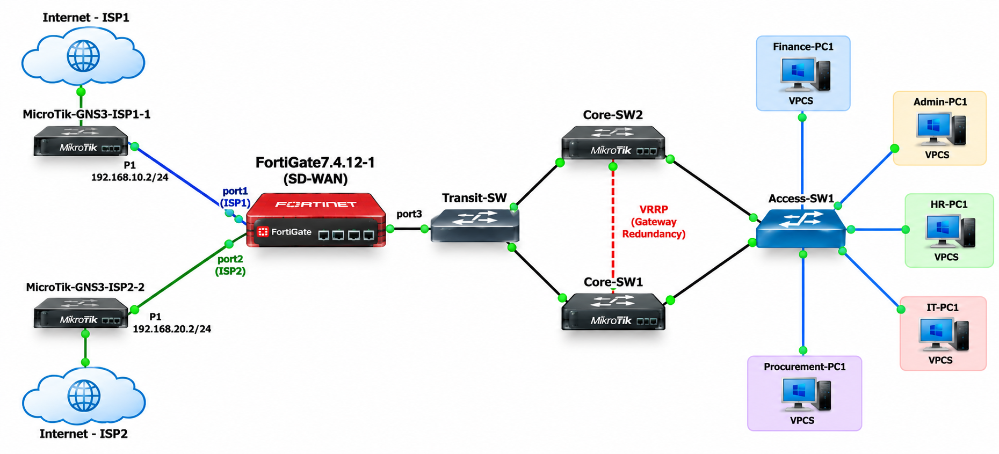

# Enterprise SD-WAN Network Lab

> A practical enterprise networking lab built in GNS3 demonstrating FortiGate SD-WAN, dual ISP redundancy, SLA-based health monitoring, MikroTik routing, VLAN segmentation, NAT, gateway redundancy, and live failover testing.

---

## Project Overview

This project is a hands-on enterprise network lab designed, configured, and tested in GNS3.

The lab simulates an enterprise environment with:

- Dual Internet Service Providers
- FortiGate SD-WAN
- SLA-based WAN health monitoring
- Automatic ISP failover
- MikroTik core routing
- VLAN-based network segmentation
- VRRP gateway redundancy
- Access switching
- Internal departmental clients
- Internet connectivity and packet-flow testing

The main objective was to build a resilient enterprise network where Internet connectivity can continue when one ISP becomes unavailable, while also providing redundancy within the internal network.

---

## Network Architecture

The lab uses a dual-ISP WAN architecture with FortiGate providing the SD-WAN edge, two MikroTik core devices providing internal routing and gateway redundancy, and an access layer connecting departmental clients.

The two ISP connections provide redundant Internet paths. FortiGate monitors the WAN links using SD-WAN health checks and determines the available WAN path based on the configured SD-WAN service.



### Main Components

| Component | Role |
|---|---|
| FortiGate 7.4.12 | Firewall, SD-WAN and WAN edge |
| ISP1 MikroTik | Simulated primary Internet provider |
| ISP2 MikroTik | Simulated secondary Internet provider |
| Core-SW1 | Core routing and VRRP gateway |
| Core-SW2 | Core routing and VRRP backup gateway |
| Access-SW1 | Access-layer connectivity |
| Transit-SW | Internal transit connectivity |
| VPCS Clients | Departmental end-user simulation |
| GNS3 NAT | Simulated external Internet connectivity |

---

## Key Objectives

The project was built to demonstrate practical skills in:

- Enterprise network design
- Network routing
- VLAN segmentation
- SD-WAN configuration
- WAN redundancy
- SLA monitoring
- Automatic failover
- Gateway redundancy
- NAT
- Network troubleshooting
- Packet-flow analysis
- Infrastructure documentation
- Network simulation using GNS3

---

# FortiGate SD-WAN

FortiGate is used as the WAN edge and SD-WAN device.

Two WAN interfaces are configured as SD-WAN members.

| SD-WAN Member | Interface | Gateway | Purpose |
|---|---|---|---|
| ISP1 | `port1` | `192.168.10.1` | Primary WAN path |
| ISP2 | `port2` | `192.168.20.1` | Secondary WAN path |

The internal network connects to FortiGate through `port3`.

### WAN addressing

```text
FortiGate port1
192.168.10.2/24
Gateway: 192.168.10.1

FortiGate port2
192.168.20.2/24
Gateway: 192.168.20.1

FortiGate port3
10.255.255.1/30
SD-WAN Health Monitoring

An SD-WAN health check named:

ISP_Health

is configured to monitor:

8.8.8.8

The health check measures WAN performance using:

Packet loss
Latency
Jitter

Configured SLA thresholds include:

Latency threshold:     300 ms
Jitter threshold:      200 ms
Packet-loss threshold: 50%

The purpose of the health check is to allow FortiGate to determine whether a WAN path is available and suitable for the SD-WAN service.

The SD-WAN service is associated with the ISP_Health check.

ISP Failover Testing

One of the main objectives of the lab was to verify that the network could continue providing Internet connectivity when an ISP connection failed.

The failover was tested from an internal client while monitoring the FortiGate SD-WAN state and packet flow.

ISP1 Failure Test

During the ISP1 failure test, the ISP1 connection was disconnected.

FortiGate subsequently reported:

port1 → DEAD
port2 → ALIVE

Traffic was then observed leaving FortiGate through port2.

The packet-flow test showed traffic such as:

Internal Client
10.10.20.10
      |
      v
FortiGate port3
      |
      v
FortiGate port2
192.168.20.2
      |
      v
ISP2
      |
      v
Internet
8.8.8.8

This demonstrated that the SD-WAN health state changed when ISP1 became unavailable and that traffic continued through the available ISP path.

The internal Finance client also remained able to reach the Internet during the ISP1 failure test.

Failover Validation

The ISP1 failure test was validated using three types of evidence:

1. SD-WAN status
ISP1 → DEAD
ISP2 → ALIVE
2. Packet flow

Traffic was observed through:

FortiGate port2
192.168.20.2
3. End-to-end connectivity

The internal client continued reaching:

8.8.8.8

This provides configuration, operational, and end-to-end evidence for the failover test.

A reverse ISP2-to-ISP1 failover should only be marked as demonstrated when the corresponding test output or packet capture is included in the evidence directory.

Core Network Redundancy

The internal core network uses VRRP to provide gateway redundancy between Core-SW1 and Core-SW2.

For the verified VRRP instance:

Virtual IP: 10.10.10.1
VRID: 10
Core-SW1
Role: MASTER
Priority: 150
Virtual IP: 10.10.10.1
Core-SW2
Role: BACKUP
Priority: 100
Virtual IP: 10.10.10.1

The configuration provides a redundant default gateway for the verified VRRP network.

Conceptually:

                  VRRP VIP
                 10.10.10.1
                      |
          +-----------+-----------+
          |                       |
      Core-SW1                Core-SW2
       MASTER                  BACKUP
      Priority 150            Priority 100

This reduces dependence on a single core gateway.

Internal Network Segmentation

The lab contains departmental and infrastructure networks including:

Network	VLAN / Purpose
HR	Department network
Finance	Department network
Procurement	Department network
IT	IT department
Administration	Administrative users
Agents	User/agent network
Servers	Server infrastructure
Management	Network management
DMZ	Isolated services

The internal network uses MikroTik routing to provide inter-network connectivity and a controlled path toward the FortiGate WAN edge.

Internet Connectivity

Internal clients use the core network as their gateway.

The traffic path toward the Internet is:

Department Client
        |
        v
Access-SW1
        |
        v
Core Network
        |
        v
Transit-SW
        |
        v
FortiGate
        |
        v
SD-WAN
   /         \
ISP1        ISP2
   \         /
     Internet

NAT is used at the appropriate WAN edge to allow private internal addresses to access the simulated Internet.

Testing and Verification

The lab was validated using a combination of device commands, connectivity tests, SD-WAN diagnostics, and packet-flow observation.

Connectivity tests

Examples include:

ping 8.8.8.8

and internal gateway tests.

FortiGate SD-WAN diagnostics

Examples include:

diagnose sys sdwan member
diagnose sys sdwan service4
diagnose sys sdwan health-check

These commands were used to inspect:

SD-WAN members
WAN health
SLA status
SD-WAN service selection
Link availability
MikroTik verification

MikroTik RouterOS commands were used to verify:

IP addressing
Routing
VRRP
Interface status
Connectivity
Core-to-core communication
Packet analysis

Packet captures were used during failover testing to verify which FortiGate WAN interface was carrying traffic.

Evidence

The project evidence is intended to demonstrate the configuration and actual operation of the lab.

The main evidence categories are:

FortiGate
SD-WAN member configuration
SD-WAN health-check configuration
SLA thresholds
SD-WAN service configuration
WAN health status
ISP Failover
ISP1 failure detection
ISP2 remaining available
Packet flow through ISP2
Internal client Internet connectivity during ISP1 failure
Core Redundancy
Core-SW1 VRRP MASTER state
Core-SW2 VRRP BACKUP state
VRRP virtual gateway

Reproducing the Lab

To reproduce this project, the following software and appliances are required:

GNS3
GNS3 VM where required
VirtualBox
MikroTik RouterOS appliances
FortiGate QEMU appliance
VPCS

The GNS3 project references external VirtualBox and QEMU appliances.

The project should therefore be treated as a lab configuration and documentation package, rather than a distribution of commercial appliance images.

VirtualBox dependencies

The GNS3 project references the following MikroTik VirtualBox machines:

MicroTIK-GNS3-Core
MicroTIK-GNS3-Core-SW2
MicroTIK-GNS3-ISP1
MicroTIK-GNS3-ISP2
FortiGate dependency

The FortiGate node requires the appropriate FortiOS QEMU appliance/image to be installed separately.

Licensed or vendor-restricted appliance images are not included in this repository.

What I Learned

This project provided practical experience in:

Designing an enterprise network topology
Configuring redundant WAN connectivity
Implementing FortiGate SD-WAN
Understanding SLA-based WAN health monitoring
Testing automatic ISP failover
Following packet flow during a WAN outage
Configuring MikroTik routing
Implementing VRRP gateway redundancy
Troubleshooting connectivity across multiple network layers
Using GNS3 for realistic network simulation
Documenting network configurations and test results

A major focus of the project was not only configuring the network, but also proving that the configuration worked through controlled failure testing and packet-flow verification.

Project Status
Implemented and tested
 Dual ISP topology
 FortiGate WAN configuration
 FortiGate SD-WAN
 SD-WAN health check
 SLA monitoring
 Internet connectivity
 ISP1 failure detection
 ISP1 → ISP2 failover
 Packet-flow verification
 Internal client connectivity during failover
 Core-SW1 VRRP MASTER
 Core-SW2 VRRP BACKUP

Author
Geofrey Nyangoya

IT Infrastructure | Network Administration | Cybersecurity

Nairobi, Kenya

This project forms part of my practical networking and cybersecurity portfolio, demonstrating hands-on experience with enterprise network infrastructure, SD-WAN, redundancy, troubleshooting, and network simulation.

Disclaimer

This project was created in a controlled laboratory environment for learning, testing, network engineering practice, and professional portfolio demonstration.

All network and failover testing was performed within the simulated GNS3 environment.
